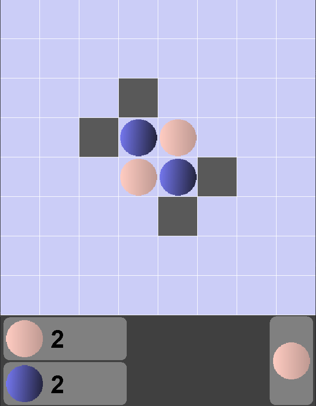

# ReversiAI

Welcome to ReversiAI, an implementation of the classic Reversi game with an AI player. This project is developed in Java and features a graphical user interface built using Java Swing.

## Overview

Reversi, also known as Othello, is a strategy board game played on an 8x8 grid. The objective is to have the majority of your pieces on the board at the end of the game. Players take turns placing their pieces on the board, with the ability to capture the opponent's pieces by surrounding them.

This implementation includes a powerful AI player based on the minimax algorithm. The AI evaluates the game state and calculates the optimal moves to make, providing a challenging opponent for players.

## Features

- Graphical user interface using Java Swing for an interactive gameplay experience.
- Single-player mode against an AI player utilizing the minimax algorithm.
- Adjustable difficulty levels for the AI opponent.
- Visual feedback for legal moves, invalid moves, and current player turn.
- Game state tracking, including scores, current turn, and game completion.

## Getting Started

To run the ReversiAI game on your local machine, follow these steps:

1. Clone this repository to your local machine.
2. Open the project in your favorite Java IDE.
3. Compile and run the `Main` class.
4. Enjoy playing Reversi against the AI opponent!

## Screenshots

## Contribution

Contributions to this project are welcome! If you find any bugs, have suggestions for improvements, or want to add new features, please feel free to open an issue or submit a pull request.

## License

This project is licensed under the [MIT License](LICENSE).
